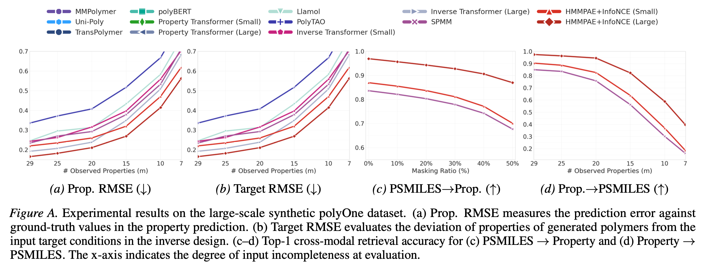
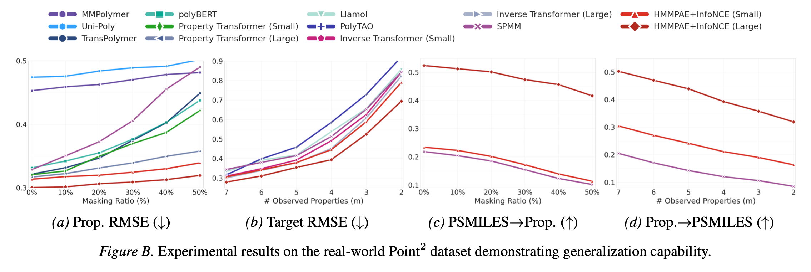
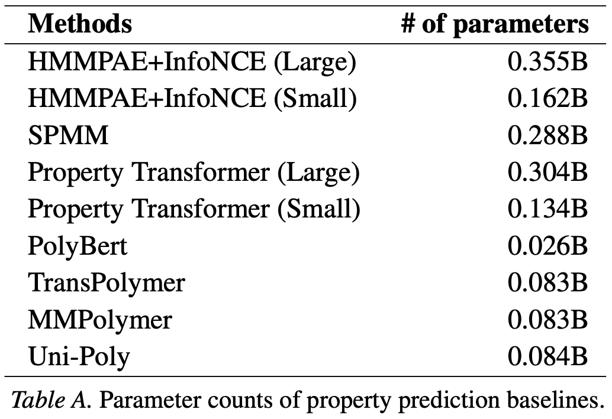
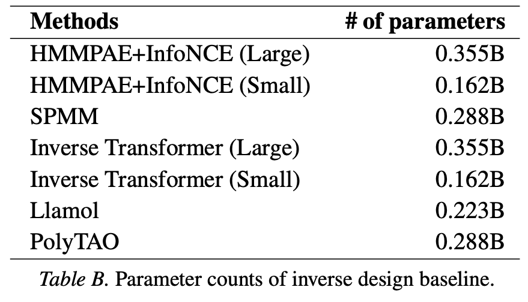

# HMMPAE Rebuttal Supplement

## Additional experimental results on polyOne

## Additional experimental results on Point2

---------------

# Parameter counts

## Parameter counts of property prediction baselines

## Parameter counts of inverse design baseline

